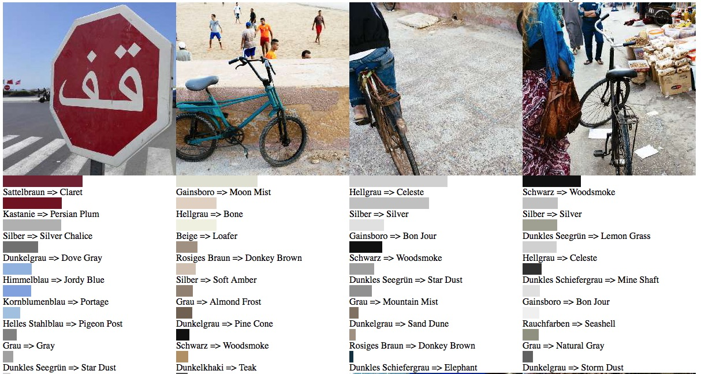

# picturecolors

list dominant picture colors and gives you a color grading recommendation for DxO 10

rewrite of the original php script in python

please see the header of the library files for copyright notes

  
